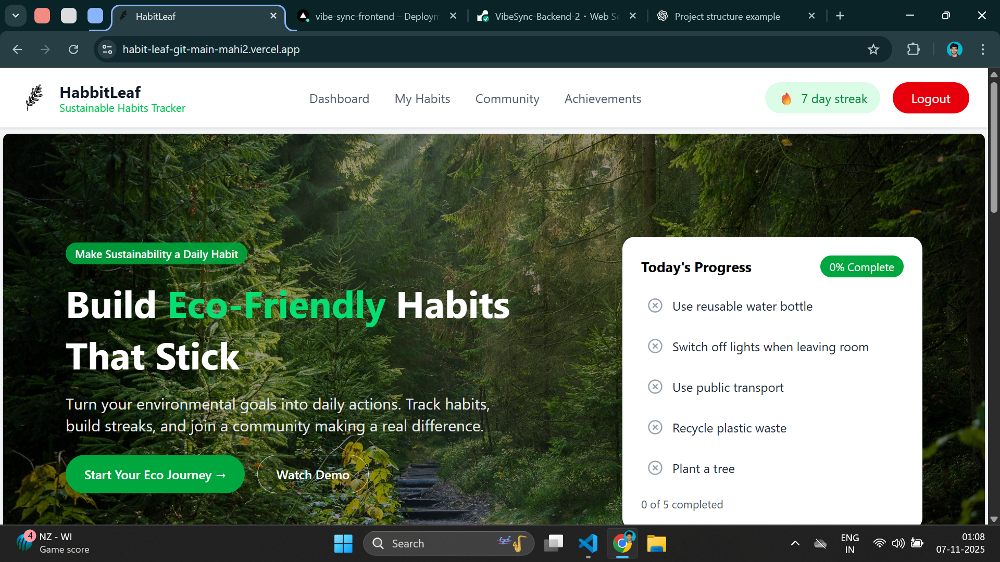
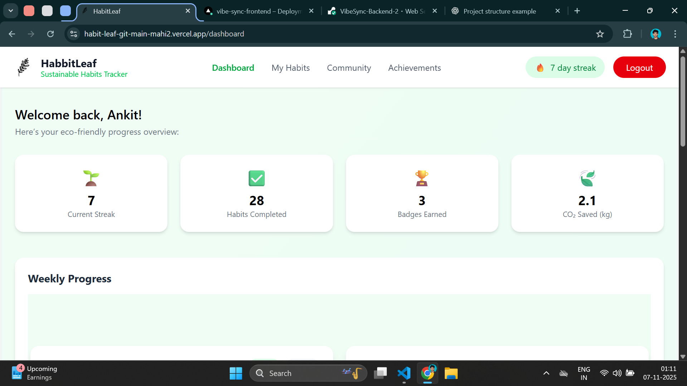
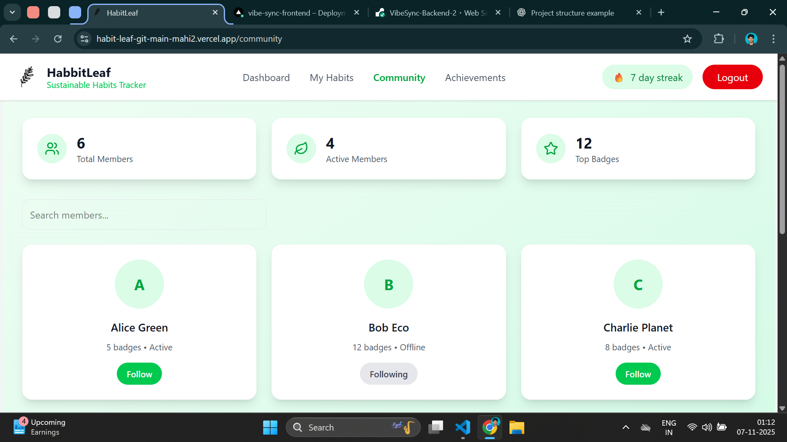
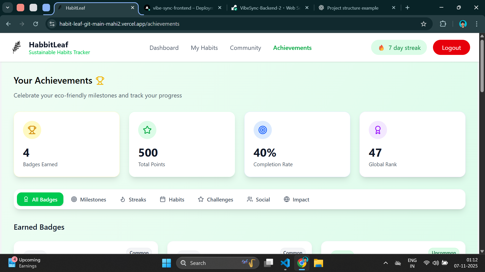

# 🌿 HabitLeaf – Sustainable Habits Tracker

**Live Demo:** [HabitLeaf on Vercel](https://habit-leaf-git-main-mahi2.vercel.app/)

---

## 🧭 Overview

**HabitLeaf** is a web application designed to help users build **eco-friendly habits** and make sustainability a part of their daily routine.  
Users can **track their progress**, **build streaks**, and join a community working toward a more sustainable lifestyle.

This project focuses on **habit tracking, progress visualization**, and **interactive UI design** to encourage consistent positive actions toward environmental goals.

---

## 🌱 Key Features

### ✅ Core Functionality

- **Daily Habit Tracking:** Add, view, and update eco-friendly habits (e.g., recycling, using public transport).
- **Progress Tracker:** Visual indicator showing daily completion percentage.
- **Streak System:** Encourages users to maintain consistency.
- **Achievement Section:** Rewards users for milestones.
- **Community Page:** Displays progress and achievements across users.

### 🧩 Additional Features

- **Responsive UI:** Fully optimized for mobile, tablet, and desktop.
- **Dynamic Dashboard:** Real-time updates of user progress.
- **Clean Navigation:** Simple layout with routes like _Dashboard_, _My Habits_, _Community_, and _Achievements_.
- **7-Day Streak Badge:** Motivates users to maintain their daily eco-goals.

---

## 💻 Tech Stack

| Category             | Technologies Used                     |
| -------------------- | ------------------------------------- |
| **Frontend**         | React.js, Vite                        |
| **Styling**          | CSS3 / TailwindCSS (if used)          |
| **State Management** | React Hooks (`useState`, `useEffect`) |
| **Routing**          | React Router DOM                      |
| **Deployment**       | Vercel                                |
| **Version Control**  | Git & GitHub                          |

---

## ⚙️ Project Structure

project-root/
│
├── backend/ # Node.js + Express + MongoDB Backend
│ ├── controllers/ # Route business logic
│ │ ├── auth.controller.js # Handles login, signup, reset password
│ │ ├── habit.controller.js # CRUD for habits
│ │ └── user.controller.js # User profile, achievements, etc.
│ │
│ ├── middlewares/ # Express middlewares
│ │ ├── authenticateJWT.js # Verify JWT token
│ │ ├── authorizeRoles.js # Role-based access control
│ │ └── errorHandler.js # Centralized error handling
│ │
│ ├── models/ # MongoDB Models (Mongoose)
│ │ ├── Achievement.js
│ │ ├── Habit.js
│ │ ├── Member.js
│ │ └── User.js
│ │
│ ├── routes/ # Express routing modules
│ │ ├── auth.routes.js # /api/auth
│ │ ├── habit.routes.js # /api/habits
│ │ └── user.routes.js # /api/users
│ │
│ ├── config/ # App configuration (recommended)
│ │ └── db.js # MongoDB connection setup
│ │
│ ├── utils/ # Helper functions (recommended)
│ │ └── tokenUtils.js # JWT creation, password hashing, etc.
│ │
│ ├── .env # Backend environment variables
│ ├── .gitignore
│ ├── package.json
│ ├── package-lock.json
│ └── server.js # Entry point (Express app)
│
│
├── frontend/ # React + Vite Frontend
│ ├── public/ # Static files
│ │ ├── leaf.svg
│ │ └── vite.svg
│ │
│ ├── src/
│ │ ├── assets/ # Images, icons, SVGs
│ │ │ ├── eye-hide.svg
│ │ │ ├── eye-show.svg
│ │ │ ├── herosection.jpg
│ │ │ ├── leaf.svg
│ │ │ ├── leaf1.svg
│ │ │ ├── react.svg
│ │ │ ├── share.svg
│ │ │ └── share1.svg
│ │ │
│ │ ├── components/ # Reusable components
│ │ │ ├── Chart.jsx # Charts for progress visualization
│ │ │ ├── Footer.jsx
│ │ │ ├── HeroSection.jsx
│ │ │ ├── Navbar.jsx
│ │ │ └── TodaysProgress.jsx
│ │ │
│ │ ├── pages/ # Page-level components (routing)
│ │ │ ├── Achievements.jsx
│ │ │ ├── Community.jsx
│ │ │ ├── Dashboard.jsx
│ │ │ ├── ForgotPassword.jsx
│ │ │ ├── Home.jsx
│ │ │ ├── Login.jsx
│ │ │ ├── MyHabbit.jsx # Typo: consider renaming to `MyHabit.jsx`
│ │ │ ├── NotFoundPage.jsx
│ │ │ ├── ResetPassword.jsx
│ │ │ └── Signup.jsx
│ │ │
│ │ ├── context/ # Global state (recommended)
│ │ │ └── AuthContext.jsx
│ │ │
│ │ ├── services/ # API interaction layer
│ │ │ ├── authService.js
│ │ │ ├── habitService.js
│ │ │ └── userService.js
│ │ │
│ │ ├── hooks/ # Custom hooks
│ │ │ ├── useAuth.js
│ │ │ └── useFetch.js
│ │ │
│ │ ├── utils/ # Client-side helper functions
│ │ │ └── formatDate.js
│ │ │
│ │ ├── styles/ # Global styles and modules
│ │ │ ├── App.css
│ │ │ └── index.css
│ │ │
│ │ ├── App.jsx # Root component (contains Router)
│ │ ├── main.jsx # Entry point (Vite + ReactDOM)
│ │ └── index.css
│ │
│ ├── .env # Frontend environment vars (e.g., API URL)
│ ├── .gitignore
│ ├── eslint.config.js
│ ├── index.html
│ ├── package.json
│ ├── package-lock.json
│ ├── vercel.json # Vercel deployment configuration
│ ├── vite.config.js
│ └── README.md
│
├── .gitignore # Root ignore (ignore both node_modules)
├── README.md # Combined documentation
└── .env # (optional) Shared environment file

---

## 📸 Screenshots

### 🏠 Home Page

### 📊 Dashboard

### 👥 Community Page

### 🏅 Achievements

